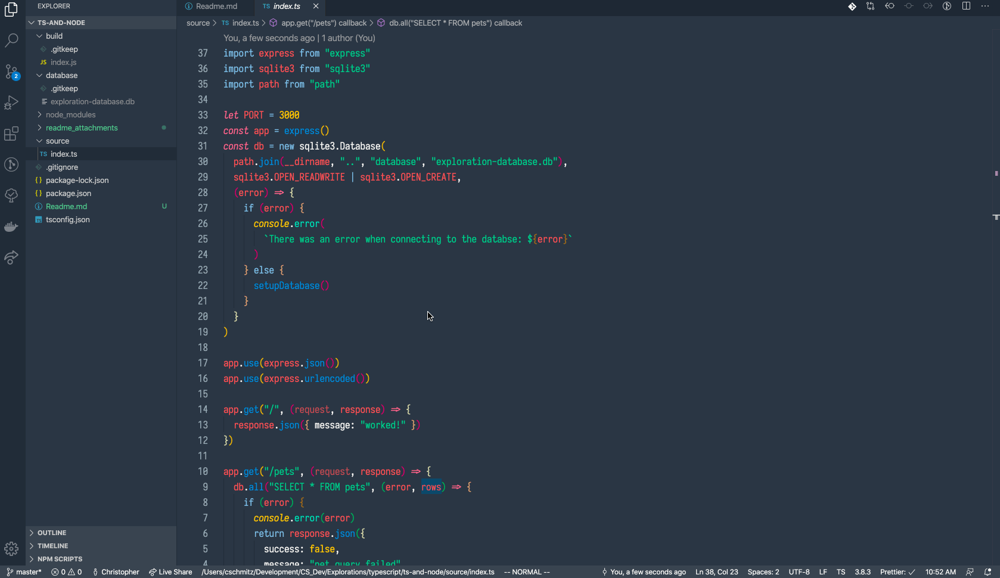

# Exploration: Node + Express + Typescript



I've been writing a bunch of strongly typed code recently and like it, so I wanted to spend some time actually picking up typescript so I can get some of that strongly typed goodness in node.

All of that said, there's not a ton of type-y stuff to see in the .ts file so far. Most of what I'm picking up is from the editor hints as I work through it and the initial tooling setup.

## up and running

```
// * pull down the codebase and install the dependencies
git clone
cd ts-and-node
npm install

npm start
```

From this point rest requests can be made to the API. See the `index.ts` file for the endpoints and details.
